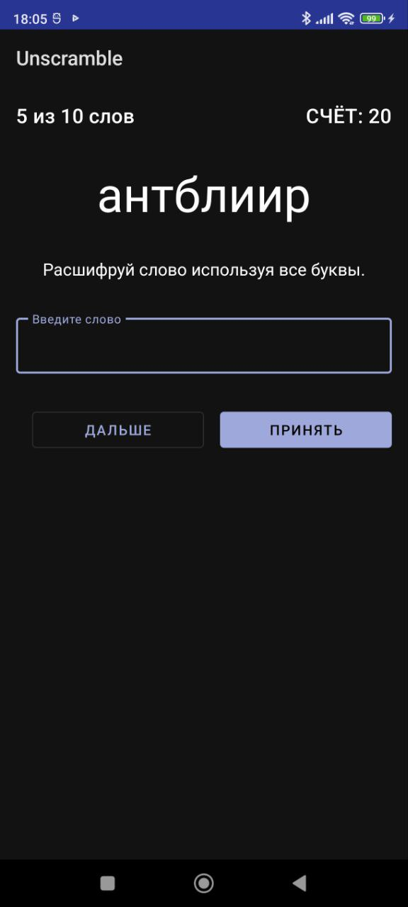

# **Unscramble App** :clipboard::lock_with_ink_pen:
### On this repository you can find an app where you need to unscramble the words
  
___
### Use this app if you want to relax or stretch your brain.
### How to play:question:
When the word appears on the screen, you need to enter it in the field below and then click on "Submit".
If the word is correct, you will get 20 points, otherwise you will be informed of the error, and you can continue to guess the word   

In total, you'll solve 10 words, after which the game will end, and you will see the number of your points.  
:exclamation: ```If you don't know the word, you can skip it by clicking "Skip". 
After that, you will see a window with the original word (of course you'll get no points)```


#### About App:
- #### Supported android versions :hammer:: 6.0 and higher
- #### Memory size :minidisc:: 18 MB

## Application screenshots:

### Dark mode and Russian :new_moon::



### Light mode and English :bulb::

